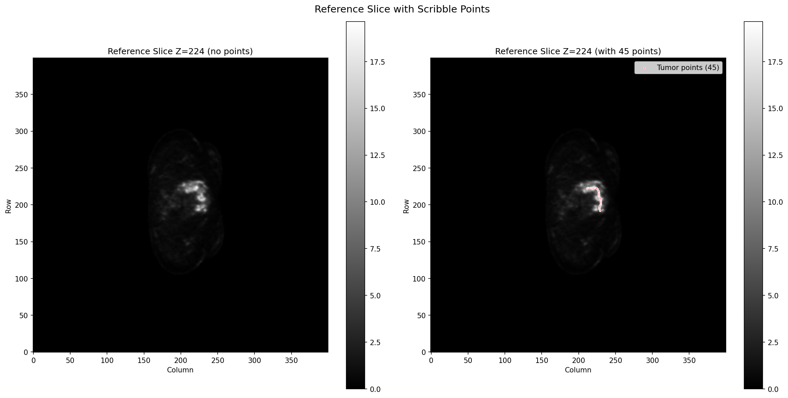
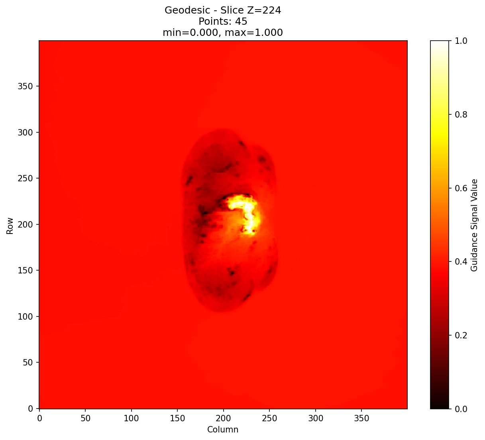
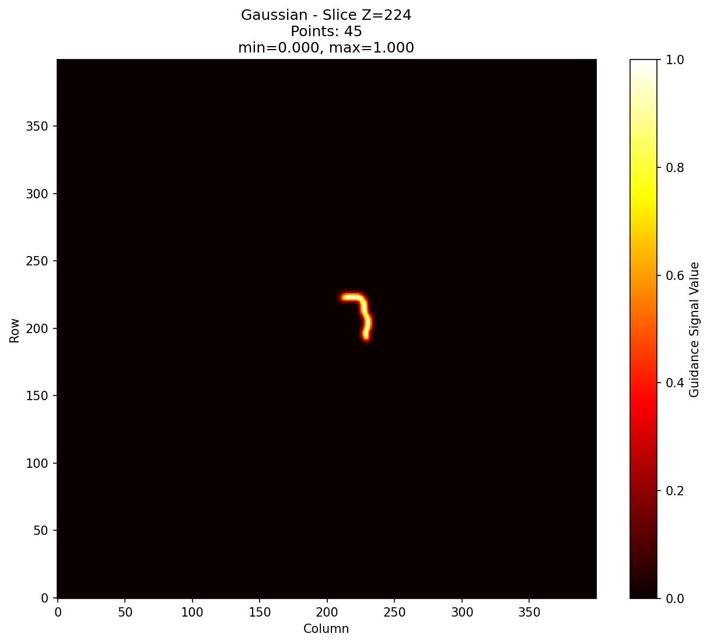

# Guidance Signal Generator
Generate 3D guidance signals from scribble coordinates.

## Installation
```
pip install numpy scipy nibabel matplotlib
pip install GeodisTK # Optional: for geodesic distance transform
pip install cupy # Optional: for GPU acceleration
```

## Input Format
```
JSON file with scribble coordinates:

json
{
  "points": [
    {"point": [167, 205, 247], "name": "tumor"},
    {"point": [192, 229, 224], "name": "tumor"},
    {"point": [167, 206, 244], "name": "background"}
  ]
}
```
Note: Only `"name": "tumor"` points are used in this tutorial.


## Signal Types

| Signal | Description | Use Case |
|--------|-------------|----------|
| `gaussian` | Gaussian heatmap around points | Simple, smooth guidance |
| `euclidean` | Euclidean distance transform | Distance-based guidance |
| `geodesic` | 2D per-slice geodesic distance | Boundary-aware guidance |
| `adaptive` | Per-point sigma based on local statistics | Adaptive, content-aware guidance |
| `combined` | Weighted average of all signals (default) | Robust, multi-modal guidance |

## Options
`python guidance_signal.py --json FILE --ref PET.nii.gz --output OUT.nii.gz [OPTIONS]`

| Option | Default | Description |
|--------|---------|-------------|
| `--signal` | `combined` | Signal type: gaussian, euclidean, geodesic, adaptive, combined |
| `--sigma` | `2.0` | Gaussian sigma |
| `--sigma-min` | `1.0` | Min sigma for adaptive heatmap |
| `--sigma-max` | `5.0` | Max sigma for adaptive heatmap |
| `--sigma-buckets` | `5` | Number of percentile buckets for adaptive heatmap |
| `--window-size` | `9` | Window size for geodesic statistics |
| `--geodesic-method` | `raster_scan` | GeodisTK method: raster_scan or fast_marching |
| `--geodesic-lambda` | `0.5` | Lambda for GeodisTK (0.0=Euclidean, 1.0=gradient-based) |
| `--geodesic-iterations` | `2` | Iterations for raster_scan |
| `--no-gpu` | `False` | Disable GPU acceleration |

# Examples

## Gaussian Heatmap with radius of 3 voxels
`python guidance_signal.py --json clicks.json --ref PET.nii.gz --output guidance.nii.gz  --signal heatmap --sigma 3`

## Geodesic Distance Transform
`python guidance_signal.py --json clicks.json --ref PET.nii.gz --output guidance.nii.gz --geodesic-lambda 0.8 --signal geodesic --geodesic-iterations 3`

## Adaptive heatmap
`python guidance_signal.py --json clicks.json --ref PET.nii.gz --output adaptive.nii.gz --signal adaptive --sigma-min 0.5 --sigma-max 9.0 --sigma-buckets 20`

# Python API
```
from guidance_signal import GuidanceSignalGenerator
generator = GuidanceSignalGenerator(ref_path='reference.nii.gz')

# Generate signals
gaussian = generator.generate('gaussian', points, sigma=2.0)
euclidean = generator.generate('euclidean', points)
geodesic = generator.generate('geodesic', points, lambda_val=0.5)
adaptive = generator.generate('adaptive', points, sigma_min=1.0, sigma_max=5.0)
combined = generator.generate('combined', points)

# Save output
generator.save(combined, 'output.nii.gz')

# Debug visualization
generator.debug_visualize(combined, points, 'output.nii.gz', 'Combined')
```

## Output
NIfTI file (guidance signal): 3D volume with values normalized to [0, 1]

## Example Images

Below are examples of different guidance signals generated from the same set of scribble points overlaid on a PET scan:

| Reference PET with Scribbles |  |
|:---:|:---:|
|  |  |

| Disks | Geodesic Distance |
|:---:|:---:|
|  |  |

| Gaussian Heatmap | Adaptive Heatmap |
|:---:|:---:|
|  |  |