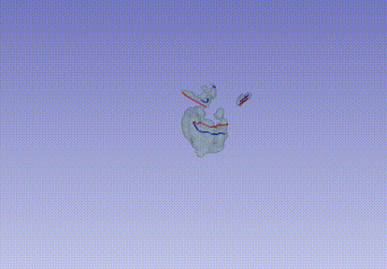

#  nnUNet baseline algorithm for autoPETV challenge 

Source code for the nnUNet baseline algorithm container for autoPETV challenge. Information about the 
submission can be found [here](https://autopet-v.grand-challenge.org/submission/) and in the [grand challenge 
documentation](https://grand-challenge.org/documentation/).

## Task
Best ranked model wins! The rules are simple: Train a model which generalizes well on FDG and PSMA data using scribbles as additional input. This baseline model is out of competition!

## Usage 

In order to use the baseline you first need to unzip the baseline weights via `bash unzip_model_weights.sh`. 
After that you can build the container by running `bash build.sh`. In order to upload the container, you will need to
save the image via `bash export.sh`.

## Testing

Use a python 3.10 based environment and install the requirements.txt file via `pip install -r requirements.txt`. 
Make sure model weights exist in `/nnUNet_results`. Unzip the baseline weights by running `bash unzip_model_weights.sh`. 
Then run `bash create_expected_output.sh` to create an expected_output mask. After that you can run `bash test.sh`.

## Baseline Method

This baseline demonstrates a simple approach for incorporating scribble-based supervision into nnU-Net.

### Input Channels

The model is trained with four input channels:

1. CT image  
2. PET image  
3. Foreground scribble heatmap  
4. Background scribble heatmap  

### Scribble Simulation

Foreground and background scribbles are simulated using the `simulate_scribbles.py` script:

```bash
ls /PATH_TO/labelsTr/ | xargs -I {} -P 4 python simulate_scribbles.py \
    --nifti /PATH_TO/labelsTr/{} \
    --strategy centerline \
    --heatmap_out ./heatmaps/
```

### What is generated?

For each ground-truth label:

- Five random connected components are selected.  
- **Foreground scribbles** are generated along the centerlines of these components.  
- **Background scribbles** are generated by:  
  - Dilating the ground-truth regions  
  - Sampling components from surrounding areas (simulating oversegmentation corrections)  

These scribbles are converted into Gaussian heatmaps and used as additional input channels.

Precomputed heatmaps are provided to participants in `heatmaps.zip`.

A visualization of the simulated scribbles is provided below (blue: `foreground` scribbles, red: `background` scribbles, green: ground-truth label).



The final step is to just train a nnUNet model with the 4 channels. That's it!

## Training

Training follows the standard nnU-Net pipeline, with the only modification being the additional input channels described above.

---

## Opportunities for Improvement

This baseline is intentionally simple and leaves several areas open for improvement.

### 1. Iterative Learning

The current model is trained in a static manner and does not explicitly learn how to update its predictions based on previous errors.

In the evaluation setting, scribbles are generated iteratively based on model mistakes. A stronger approach would explicitly model this interaction process **during training** and learn how to refine predictions over multiple iterations.

---

### 2. Scribble Integration

In this baseline, scribbles are concatenated with the input images as additional channels. This allows the network to use them, but does not enforce their importance, e.g., the model can simply ignore the scribble channels.

More advanced approaches could:

- Explicitly guide the model and post-process its output to make sure it conforms to the scribbles 
- Ensure that scribbles are treated as strong supervision signals rather than optional inputs  

---

### 3. Representation of Scribbles

Gaussian heatmaps are one way to encode scribbles, but alternative representations may be more effective.

Possible directions include:

- Distance transforms  
- Binary masks  
- Learned embeddings or guidance signals  

---

### 4. Local vs. Global Updates

Consider how predictions should be updated in response to new scribbles:

- Should updates affect the entire segmentation?  
- Or only regions near the latest interactions?  

Balancing local corrections with global consistency is an important design choice.

---

## Practical Note

The Grand Challenge interface does not provide persistent storage for intermediate predictions between iterations.

You can implement your own mechanism by writing intermediate results to a temporary directory and reloading them in subsequent iterations.  

For example, this is done in `interactive_loop.py` using the `args.result_dir` directory to store predictions from previous iterations.  

You may also implement your own buffering strategy to ensure temporal consistency between iterations (e.g., preventing large, unnecessary changes between iteration *t* and *t-1*).


